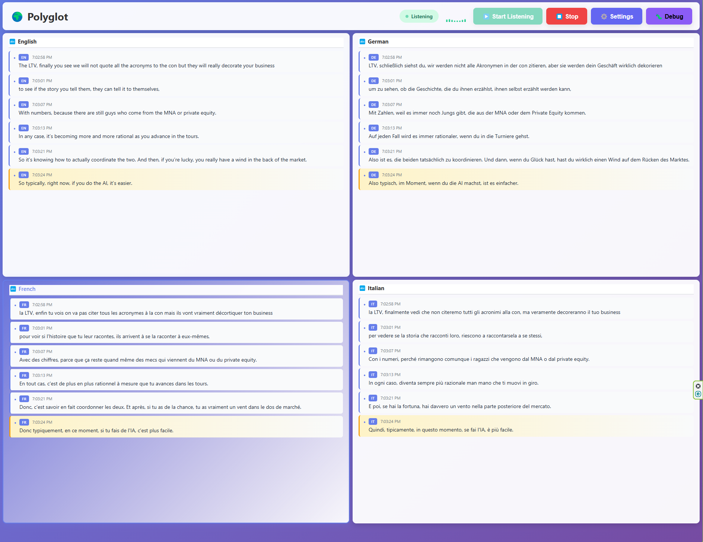

# Polyglot 🌍

Real-time multi-language audio translator with live transcription and translation. Polyglot captures system audio (games, videos, streams) and translates speech into multiple target languages simultaneously using AI.


## 📸 Screenshot



*Real-time translations in 4 languages with live audio visualization and debug panel*

## ✨ Features

- 🎧 **System Audio Capture** - Translates any audio playing on your computer via WASAPI loopback (Windows)
- 🗣️ **Auto Language Detection** - Automatically detects the spoken language using Whisper
- 🚀 **GPU Accelerated** - Runs on CUDA-enabled GPUs (RTX 5080 tested with PyTorch nightly)
- ⚡ **Parallel Translation** - Translates to multiple languages simultaneously using threading
- 🎯 **Smart Sentence Detection** - Configurable silence detection for natural sentence boundaries
- 📊 **Real-time Dashboard** - Live visual feedback with audio level graphs and debug metrics
- 💾 **Auto-Save** - Continuous transcript logging to `transcript.txt`
- ⚙️ **Live Configuration** - Adjust detection thresholds in real-time via web UI

## 🛠️ Tech Stack

- **Transcription**: OpenAI Whisper `large-v3` (multilingual speech recognition)
- **Translation**: Meta M2M100 `1.2B` (100 languages support)
- **Backend**: Flask + SocketIO (WebSocket real-time communication)
- **Frontend**: Vanilla JavaScript with real-time updates
- **Audio**: PyAudioWPatch (WASAPI loopback for Windows system audio)
- **GPU**: PyTorch with CUDA 12.9 (RTX 5080 Blackwell support)

## 📋 Requirements

### Hardware
- **GPU**: CUDA-enabled GPU (RTX 5080 or compatible)
- **RAM**: 16GB+ recommended
- **VRAM**: 10GB+ for Whisper large-v3 + M2M100 1.2B
- **OS**: Windows (for WASAPI loopback audio)

### Software
- Python 3.8+
- CUDA Toolkit 12.9+
- PyTorch 2.10+ (nightly build for RTX 5080)

## 🚀 Installation

### 1. Clone the repository
```bash
git clone https://github.com/yourusername/polyglot.git
cd polyglot
```

### 2. Create virtual environment
```bash
python -m venv venv
venv\Scripts\activate  # Windows
```

### 3. Install PyTorch with CUDA 12.9 (for RTX 5080)
```bash
pip install --pre torch --index-url https://download.pytorch.org/whl/nightly/cu129
```

### 4. Install dependencies
```bash
pip install flask flask-socketio transformers
pip install pyaudiowpatch soundfile resampy
pip install langdetect numpy
```

### 5. Download models (first run)
Models will be automatically downloaded on first run:
- Whisper large-v3: ~3GB
- M2M100 1.2B: ~5GB

## 🎯 Usage

### 1. Start the application
```bash
python app.py
```

You should see:
```
============================================================
Polyglot 🌍 - Real-time Audio Translator
============================================================

Open your browser to: http://localhost:5000
Device: cuda
Whisper Model: large-v3
Translation Model: facebook/m2m100_1.2B
Target languages: English, German, French, Italian

Press Ctrl+C to stop
```

### 2. Open the web interface
Navigate to `http://localhost:5000` in your browser

### 3. Configure target languages
Click **⚙️ Settings** to:
- Select target languages for translation
- Adjust audio detection thresholds
- Fine-tune sentence detection sensitivity

### 4. Start listening
1. Click **▶️ Start Listening**
2. Play any audio on your computer (YouTube, games, etc.)
3. Watch real-time transcriptions and translations appear!

### 5. Debug mode (optional)
Click **🐛 Debug** to see:
- Real-time audio level graphs
- Silence detection progress
- Buffer status and processing state

## ⚙️ Configuration

Edit `config.py` to customize:

```python
class Config:
    # Model selection
    WHISPER_MODEL = "large-v3"  # tiny, base, small, medium, large, large-v2, large-v3
    TRANSLATION_MODEL = "facebook/m2m100_1.2B"  # or m2m100_418M for faster/lighter

    # Target languages
    TARGET_LANGUAGES = [
        {"code": "en", "name": "English"},
        {"code": "de", "name": "German"},
        {"code": "fr", "name": "French"},
        {"code": "it", "name": "Italian"},
    ]

    # Audio detection thresholds
    MIN_AUDIO_LENGTH = 3.0      # Minimum seconds before processing
    MAX_AUDIO_LENGTH = 30.0     # Maximum seconds (force processing)
    SILENCE_THRESHOLD = 0.01    # Volume level considered silence
    SILENCE_CHUNKS = 15         # Consecutive silent chunks to trigger end
```

## 🌐 Supported Languages

Polyglot supports **100+ languages** via M2M100:

**Major Languages**: English, German, French, Spanish, Italian, Portuguese, Dutch, Polish, Russian, Chinese, Japanese, Korean, Arabic, Hindi, Turkish, Vietnamese, Thai, Indonesian, Hebrew, Greek, Swedish, Danish, Norwegian, Finnish, Czech, Romanian, Ukrainian, Persian, Bengali, Tamil, Telugu, Urdu, and many more!

See [M2M100 documentation](https://huggingface.co/facebook/m2m100_1.2B) for full language list.

## 🎛️ Advanced Features

### Live Threshold Adjustment
Adjust audio detection parameters in real-time:
- **Min Audio Length**: Increase to avoid tiny fragments, decrease for shorter sentences
- **Max Audio Length**: Increase for longer sentences, decrease if cutting mid-speech
- **Silence Threshold**: Increase if breaking at small pauses, decrease if missing breaks
- **Silence Duration**: Increase if breaking too often, decrease if running together

### Visual Debug Panel
Monitor audio processing in real-time:
- **Audio Level Graph**: Green bar shows current audio level vs threshold (orange line)
- **Silence Counter Graph**: Blue bar shows progress toward sentence detection
- **Processing Stats**: Buffer size, processing state, chunk limits

### Transcript Logging
All transcriptions are automatically saved to `transcript.txt` with timestamps.

## 🐛 Troubleshooting

### GPU Not Detected
```
Device: cpu
```
**Solution**: Install PyTorch with CUDA support:
```bash
pip install --pre torch --index-url https://download.pytorch.org/whl/nightly/cu129
```

### No Audio Captured
**Solution**: Check that audio is playing and verify WASAPI loopback device in logs.

### Sentences Breaking Too Often
**Solution**: Increase `SILENCE_CHUNKS` in Settings or `config.py`

### Sentences Running Together
**Solution**: Decrease `SILENCE_CHUNKS` and/or `SILENCE_THRESHOLD`

### Hallucinations (Random Text During Silence)
**Solution**: Already handled via `MIN_AUDIO_LEVEL` check. Increase if needed.

## 📊 Performance

On RTX 5080:
- **Whisper large-v3**: ~1-3 seconds per sentence
- **M2M100 1.2B**: ~0.3-0.5 seconds per language (parallel)
- **Total latency**: ~2-4 seconds from speech to translation

## 🤝 Contributing

Contributions are welcome! Please feel free to submit a Pull Request.

1. Fork the repository
2. Create your feature branch (`git checkout -b feature/AmazingFeature`)
3. Commit your changes (`git commit -m 'Add some AmazingFeature'`)
4. Push to the branch (`git push origin feature/AmazingFeature`)
5. Open a Pull Request

## 📝 License

This project is licensed under the MIT License - see the [LICENSE](LICENSE) file for details.

## 🙏 Acknowledgments

- [OpenAI Whisper](https://github.com/openai/whisper) - Speech recognition
- [Meta M2M100](https://huggingface.co/facebook/m2m100_1.2B) - Translation model
- [PyAudioWPatch](https://github.com/s0d3s/PyAudioWPatch) - WASAPI audio capture
- [Flask-SocketIO](https://flask-socketio.readthedocs.io/) - Real-time communication

## 📧 Contact

Project Link: [https://github.com/yourusername/polyglot](https://github.com/yourusername/polyglot)

---

Made with ❤️ for the multilingual community
